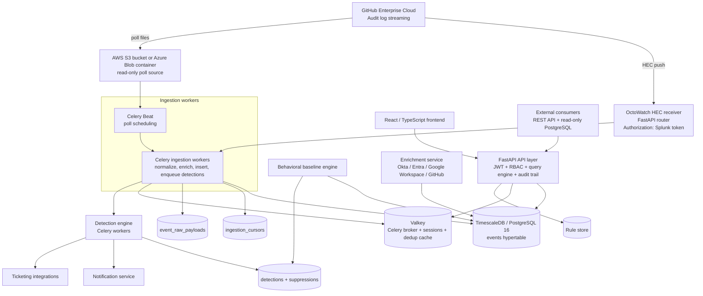
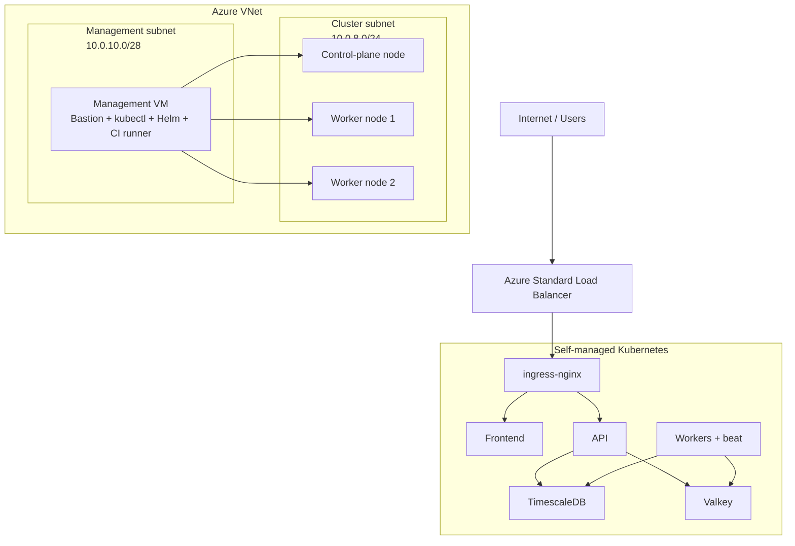

# OctoWatch — System Architecture

**Version**: 1.0  
**Date**: 2026-03-25  
**Status**: Approved for Development

---

## Table of Contents

1. [System Overview](#1-system-overview)
2. [Component Breakdown](#2-component-breakdown)
3. [Database Schema](#3-database-schema)
4. [Technology Stack Table](#4-technology-stack-table)
5. [Technical Risks](#5-technical-risks)

---

## 1. System Overview

### 1.1 Component Diagram

#### Production deployment topology

OctoWatch's primary production deployment is a **self-managed kubeadm cluster on
Azure VMs**. Terraform provisions a dedicated management VM in the management
subnet, three Kubernetes nodes in the cluster subnet, and an Azure Standard Load
Balancer for HTTP/S ingress.

### 1.2 Data Flow Narrative

**Poll / Push** — Four ingestion modes are supported, selected via `INGESTION_MODE` env var:

- **`hec`** _(default)_ — GitHub Enterprise streams audit log events directly to the Splunk HEC-compatible endpoint (`POST /services/collector`). Authenticated with `Authorization: Splunk <HEC_TOKEN>`. No polling required; real-time ingestion.
- **`webhook`** — Raw GitHub audit log webhook payloads received at `POST /api/v1/ingest/webhook`. Authenticated with a shared HMAC secret.
- **`s3`** — Celery Beat fires `ingestion.poll_sources` every 1–15 minutes. Worker lists all S3 object keys with a prefix lexicographically greater than `last_prefix` using `ListObjectsV2 StartAfter`.
- **`azure_blob`** — Same polling model; uses `list_blobs(name_starts_with=last_prefix)`.

For all modes, each Ingestion Worker acquires a source lock using `SELECT id FROM ingestion_cursors WHERE status = 'active' AND source_type = $1 FOR UPDATE SKIP LOCKED LIMIT 1`. Multiple workers can run in parallel, each processing a different source.

**Parse** — The worker lists all object keys under prefixes lexicographically greater than `last_prefix` (using S3 `ListObjectsV2` with `StartAfter` or Azure Blob `list_blobs` with `name_starts_with`). Each `.json.gz` is streamed, decompressed via Python `gzip.GzipFile`, and each newline-delimited JSON record is parsed.

**Dedup** — Each parsed record's `_document_id` is checked against a Valkey SET (24-hour TTL, O(1)). On a cache miss, the `event_dedup` table is queried. Records with a known `document_id` are silently discarded. This handles GitHub's at-least-once delivery guarantee without relying on GitHub to deduplicate for us.

**Normalize** — Each raw record is validated against `EventSchema` (Pydantic v2). Standard fields (`actor`, `actor_id`, `org`, `org_id`, `repo`, `action`, `created_at`, `source_ip`, `user_agent`) are mapped to typed columns. All remaining fields are preserved in `data JSONB`. The `namespace` column is derived as `split_part(action, '.', 1)` (stored, generated column).

**Store** — Normalized events are bulk-inserted into the `events` TimescaleDB hypertable via multi-row `INSERT ... ON CONFLICT (document_id) DO NOTHING`. The raw JSON is stored in `event_raw_payloads`. `event_dedup` rows and the `ingestion_cursors.last_prefix` are committed atomically in the same transaction. On failure, the cursor does not advance and the batch is retried from the same position.

**Detect** — After batch commit, the worker enqueues a `detection.evaluate_batch` Celery task with the list of new event IDs. Detection workers fetch those events, evaluate all enabled `rule_definitions` using the JSON-DSL interpreter, check `detection_suppressions`, and write matching `detections`. Severity is resolved against `severity_configs`. Auto-ticket and notification tasks are enqueued if configured.

**Serve** — FastAPI serves all reads from PostgreSQL through scoped SQLAlchemy queries. Every API request undergoes JWT validation, RBAC scope resolution, and appends a row to `audit_trail`. The React frontend exclusively communicates via the REST API.

---

## 2. Component Breakdown

### 2.1 Ingestion Worker

| Field | Details |
|-------|---------|
| **Purpose** | Receives HEC payloads or polls object storage, normalizes events, enriches, writes to TimescaleDB |
| **Inputs** | HEC HTTP payloads, S3 objects, Azure Blob objects |
| **Outputs** | `events`, `event_raw_payloads`, `event_dedup`, `ingestion_cursors`, Celery detection tasks |
| **Scaling** | Horizontal — multiple workers can process different sources in parallel |
| **Failure handling** | Cursor advance, dedup insert, and event insert happen in one transaction |

### 2.2 Event Store

| Field | Details |
|-------|---------|
| **Technology** | PostgreSQL 16 + TimescaleDB |
| **Role** | Durable event storage and analytics backbone |
| **Data model** | `events` hypertable with compression and time-based partitioning |
| **Operational note** | Primary production deployments place this on persistent Kubernetes storage |

### 2.3 Detection Engine

| Field | Details |
|-------|---------|
| **Purpose** | Applies enabled rule definitions to newly ingested events |
| **Execution** | Celery workers |
| **Outputs** | `detections`, notifications, ticketing actions |
| **Failure handling** | Celery retry semantics + idempotent writes |

### 2.4 Behavioral Baseline Engine

| Field | Details |
|-------|---------|
| **Purpose** | Computes rolling baselines for anomaly-style rules |
| **Execution** | Scheduled background task |
| **Outputs** | `behavioral_baselines` |

### 2.5 GeoIP Service

| Field | Details |
|-------|---------|
| **Purpose** | Resolves source IPs into location metadata |
| **Data source** | MaxMind GeoLite2 |
| **Used by** | Ingestion and impossible-travel rules |

### 2.6 Enrichment Service

| Field | Details |
|-------|---------|
| **Purpose** | Adds actor and identity context from external systems |
| **Data sources** | Okta, Entra ID, Google Workspace, GitHub APIs |
| **Outputs** | `idp_actor_enrichments` and related cached context |

### 2.7 Query Engine

| Field | Details |
|-------|---------|
| **Purpose** | Executes analyst-authored SQL safely |
| **Controls** | AST validation, read-only enforcement, row limits, scope injection |
| **Security** | Prevents unscoped access to multi-tenant data |

### 2.8 Reporting Engine

| Field | Details |
|-------|---------|
| **Purpose** | Powers dashboards and operational metrics |
| **Optimization** | Uses TimescaleDB compression and rollups / aggregates |
| **Consumers** | Frontend dashboards and external analysts |

### 2.9 API Layer

| Field | Details |
|-------|---------|
| **Technology** | FastAPI |
| **Responsibilities** | Auth, RBAC, CRUD APIs, HEC receiver, query API, audit trail |
| **Scalability** | Stateless; horizontally scalable behind any HTTP load balancer; JWT verification is signature-only (no DB call on hot path) |

### 2.10 Web Frontend

| Field | Details |
|-------|---------|
| **Technology** | React 19 + TypeScript + Vite |
| **Responsibilities** | Dashboards, detections, query UI, rules UI, admin UI |
| **Dependency** | Talks only to the API layer |

### 2.11 Rule Store

| Field | Details |
|-------|---------|
| **Purpose** | Stores rule definitions and rule versions |
| **Persistence** | PostgreSQL tables with optional Git-backed workflow |
| **Consumers** | Detection engine and admin UI |

### 2.12 Ticketing Integration

| Field | Details |
|-------|---------|
| **Purpose** | Opens or links Jira issues / GitHub Issues from detections |
| **Trigger** | Detection engine or analyst action |
| **Failure mode** | External API failures are isolated from core ingest |

### 2.13 Notification Service

| Field | Details |
|-------|---------|
| **Purpose** | Sends Slack and SMTP notifications |
| **Trigger** | Detection engine and scheduled digests |
| **Failure mode** | Retries and dead-letter handling are application controlled |

### 2.14 Auth / RBAC

| Field | Details |
|-------|---------|
| **Inputs** | GitHub OAuth, optional SAML |
| **Session model** | JWT with Valkey-backed session presence |
| **Authorization** | Team-to-role mapping plus org/repo scope enforcement |

### 2.15 Audit Trail

| Field | Details |
|-------|---------|
| **Purpose** | Records all state-changing actions in OctoWatch |
| **Storage** | `audit_trail` |
| **Value** | Supports accountability and post-incident review |

### 2.16 Admin Portal

| Field | Details |
|-------|---------|
| **Purpose** | Lets privileged users manage integrations, rules, roles, and system config |
| **Security** | `sys_admin`-guarded |
| **Auditability** | All mutations recorded in `audit_trail` |

### 2.17 Cursor / State Store

| Field | Details |
|-------|---------|
| **Purpose** | Tracks source progress and operational state |
| **Primary table** | `ingestion_cursors` |
| **Consistency** | Updated transactionally with ingest work |

### 2.18 HEC Ingestion Endpoint

| Field | Details |
|-------|---------|
| **Path** | `POST /services/collector` |
| **Auth** | `Authorization: Splunk <HEC_TOKEN>` |
| **Formats** | Single JSON, NDJSON, concatenated JSON |
| **Health** | `GET /services/collector/health` |

---

## 3. Database Schema

### Prerequisites

- PostgreSQL 16
- TimescaleDB extension enabled
- Application migrations applied via Alembic

### 3.1 `events`

The `events` hypertable stores normalized GitHub audit log records.

| Column | Type | Notes |
|--------|------|-------|
| `id` | `BIGSERIAL` | Primary key |
| `document_id` | `TEXT` | GitHub-provided stable identifier; unique for dedup |
| `created_at` | `TIMESTAMPTZ` | Event timestamp; hypertable partition key |
| `actor` | `TEXT` | Login or service principal |
| `actor_id` | `TEXT` | Upstream actor identifier |
| `actor_type` | `TEXT` | User, integration, bot, etc. |
| `org` | `TEXT` | Organization login |
| `org_id` | `TEXT` | Organization identifier |
| `repo` | `TEXT` | Repository login if present |
| `repo_id` | `TEXT` | Repository identifier if present |
| `action` | `TEXT` | Full audit action name |
| `namespace` | `TEXT` | Generated from the action prefix |
| `source_ip` | `INET` | Actor IP when available |
| `user_agent` | `TEXT` | Upstream user agent |
| `data` | `JSONB` | Remaining upstream payload |

### 3.2 `event_dedup`

Stores recently seen `document_id` values used for durable deduplication.

### 3.3 `event_raw_payloads`

Stores the raw event JSON for replay, debugging, and auditability.

### 3.4 `ingestion_cursors`

Tracks the last processed key / prefix for each poll-based source.

### 3.5 `detections`

Stores rule matches, severity, lifecycle state, and analyst workflow fields.

### 3.6 `detection_suppressions`

Stores suppression rules and windows that prevent expected or noisy detections.

### 3.7 `severity_configs`

Stores per-rule or global severity thresholds and mappings.

### 3.8 `behavioral_baselines`

Stores rolling statistical baselines used by anomaly-style detections.

### 3.9 `audit_trail`

Stores immutable before/after records for state-changing application actions.

### 3.10 `rbac_roles` and `user_role_assignments`

Stores roles and scoped assignments for authorization enforcement.

### 3.11 `rule_definitions` and `rule_versions`

Stores rule metadata, DSL bodies, change history, and publication status.

### 3.12 `idp_actor_enrichments`

Stores resolved user metadata from identity providers.

### 3.13 `ticketing_configs` and `tickets`

Stores downstream ticket integration settings and created ticket references.

### 3.14 `notification_configs`

Stores Slack / SMTP configuration and delivery preferences.

---

## 4. Technology Stack Table

| Layer | Technology |
|-------|------------|
| Frontend | React, TypeScript, Vite |
| API | FastAPI |
| Async execution | Celery |
| Cache / broker | Valkey |
| Database | PostgreSQL 16 + TimescaleDB |
| Container packaging | Docker |
| Kubernetes packaging | Helm |
| Primary Azure topology | kubeadm on Azure VMs |
| Ingress | ingress-nginx |
| TLS | cert-manager + Let's Encrypt |

---

## 5. Technical Risks

### Risk 1: TimescaleDB Hypertable Deduplication Constraint

Dedup must stay compatible with hypertable partitioning and unique-key rules.

### Risk 2: Impossible-Travel False Positives from Shared Infrastructure

Shared egress IPs and proxy layers can distort geo signals if not normalized.

### Risk 3: S3 / Azure Blob Listing Performance During Backfill

Large backfills may create long object-listing windows and queue bursts.

### Risk 4: SAML XML Signature Wrapping and XXE Vulnerabilities

SAML processing remains a high-risk area and must stay tightly validated.

### Risk 5: Self-Service Query Engine SQL Injection and Data Exfiltration

The query engine must continue enforcing AST-level validation and scope rewrite.

### Risk 6: Rule Author Privilege through Arbitrary Logic Execution

Rule DSL execution must remain sandboxed and limited to approved operators.

### Risk 7: Ingestion Cursor Gap or Duplication on Worker Crash

Cursor and dedup writes must remain transactionally coupled to event insert.

### Risk 8: IdP Enrichment Token Expiry Silently Breaking Actor Context

External identity integrations can fail quietly without robust health checks.

### Risk 9: Event Volume Spike Overwhelming Detection Workers

Burst handling depends on queue visibility, worker sizing, and operational alerts.

### Risk 10: MaxMind GeoLite2 License Compliance

GeoIP data use must stay aligned with license and distribution requirements.
