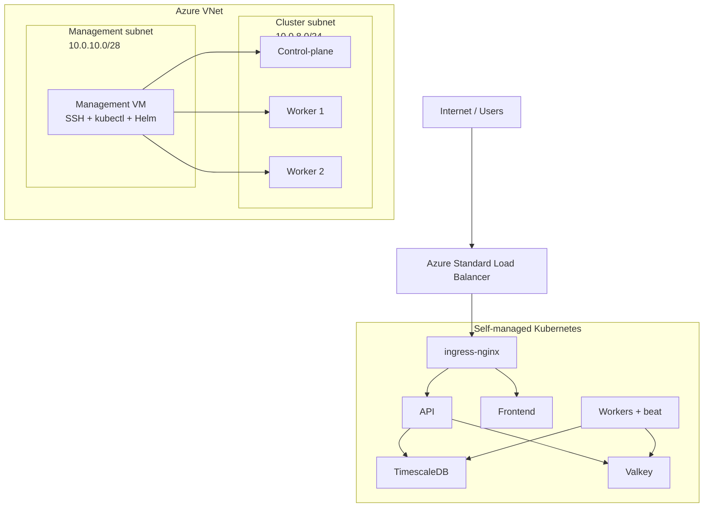

# OctoWatch Deployment Guide

OctoWatch's primary Azure deployment target is the **self-managed kubeadm
cluster provisioned by Terraform**. Docker Compose remains available for local
work and small single-host installs.

The standard production path is:

**Terraform provisions Azure VMs → kubeadm bootstraps Kubernetes → Helm deploys OctoWatch**

---

## 1. Deployment Modes

| Mode | Use case | Primary admin entry point |
|------|----------|---------------------------|
| Self-managed Kubernetes | Recommended production deployment | Management VM |
| Docker Compose | Development / small installs | The Docker host |

---

## 2. Prerequisites

### Self-managed Kubernetes

- Terraform 1.7+
- Azure CLI
- SSH key pair for the management VM
- GHCR credentials for image pulls
- A DNS name for the public endpoint
- GitHub OAuth credentials
- Optional: GitHub App credentials for enterprise sync

### Docker Compose

- Docker Engine 24+
- Docker Compose v2
- 4 vCPU / 8 GB RAM minimum
- TLS certificates for anything beyond local testing

---

## 3. Recommended Production Deployment: Self-Managed Kubernetes

### 3.1 Provision infrastructure with Terraform

From the repository root:

```bash
cd terraform
terraform init
terraform plan -var-file=terraform.tfvars
terraform apply -var-file=terraform.tfvars
```

The primary infrastructure lives in [`terraform/k8s-cluster.tf`](../terraform/k8s-cluster.tf).
It provisions:

- 1 management VM (`10.0.10.0/28`)
- 1 control-plane node + 2 worker nodes (`10.0.8.0/24`)
- Azure Standard Load Balancer for HTTP/S ingress

Legacy AKS resources remain in [`terraform/aks.tf`](../terraform/aks.tf), gated
behind `enable_aks`, but are not the recommended path.

### 3.2 Connect to the management VM

Use the Terraform output after `apply`:

```bash
cd terraform
terraform output -raw k8s_mgmt_ssh_command
```

Then SSH in and do all cluster administration from there:

```bash
ssh octowatch@<k8s-mgmt-public-ip>
```

The management VM is the canonical place to run:

- `kubectl`
- `helm`
- cluster troubleshooting commands
- ad-hoc backup / restore operations

### 3.3 Verify cluster bootstrap

On the management VM:

```bash
kubectl get nodes -o wide
kubectl get pods -A
kubectl get storageclass
kubectl get pods -n ingress-nginx
kubectl get pods -n cert-manager
```

The bootstrap scripts install:

- `kubectl` and Helm on the management VM
- `ingress-nginx`
- `cert-manager`
- a default storage class for the cluster
- the `ghcr-pull-secret` in the `octowatch` namespace

If you replace the default storage class with another CSI driver (for example,
Longhorn), update the Helm overlay accordingly before deploying.

### 3.4 Prepare OctoWatch values and secrets

The repository includes a self-managed overlay at
[`helm/values-selfmanaged.yaml`](../helm/values-selfmanaged.yaml).

Create the application secrets on the cluster from the management VM:

```bash
kubectl create namespace octowatch 2>/dev/null || true

kubectl create secret generic octowatch-db-secret   --namespace octowatch   --from-literal=postgres-password="$(openssl rand -hex 16)"   --from-literal=app-password="$(openssl rand -hex 16)"   --dry-run=client -o yaml | kubectl apply -f -

kubectl create secret generic octowatch-valkey-secret   --namespace octowatch   --from-literal=valkey-password="$(openssl rand -hex 16)"   --dry-run=client -o yaml | kubectl apply -f -

kubectl create secret generic octowatch-app-secret   --namespace octowatch   --from-literal=secret-key="$(openssl rand -hex 32)"   --from-literal=encryption-key="$(openssl rand -hex 32)"   --from-literal=github-client-id="<github-client-id>"   --from-literal=github-client-secret="<github-client-secret>"   --from-literal=hec-token="$(openssl rand -hex 32)"   --dry-run=client -o yaml | kubectl apply -f -
```

Review and customize:

- `helm/values.yaml`
- `helm/values-selfmanaged.yaml`

At minimum, set:

- `global.image.registry`
- `global.image.tag`
- `ingress.host`
- `ingress.tls.secretName`
- storage class settings if your cluster uses something other than the default

### 3.5 Deploy OctoWatch with Helm

Run this on the management VM:

```bash
cd /path/to/octowatch
helm dependency build ./helm
helm upgrade --install octowatch ./helm   -f helm/values.yaml   -f helm/values-selfmanaged.yaml   --set global.image.tag=<image-tag>   --namespace octowatch   --create-namespace   --wait   --timeout 10m
```

This is the same deployment pattern used by the publish workflow on the
self-hosted runner.

### 3.6 Verify the deployment

From the management VM:

```bash
kubectl get pods -n octowatch
kubectl rollout status deployment/octowatch-api -n octowatch --timeout=120s
kubectl rollout status deployment/octowatch-frontend -n octowatch --timeout=120s
kubectl logs deployment/octowatch-api -n octowatch --tail=50
```

Find the public ingress IP:

```bash
kubectl get svc -n ingress-nginx
```

Or use Terraform output:

```bash
cd /path/to/octowatch/terraform
terraform output -raw k8s_lb_public_ip
```

Then verify health:

```bash
curl -sf https://<your-domain>/health
curl -sf https://<your-domain>/ready
```

---

## 4. Development / Small Deployment: Docker Compose

For local work or single-host installs:

```bash
git clone https://github.com/<owner>/octowatch.git
cd octowatch
python scripts/gen_env.py
cd nginx/ssl
openssl req -x509 -nodes -days 365 -newkey rsa:2048   -keyout key.pem -out cert.pem -subj "/CN=localhost"
cd ../..
docker compose up -d --build
curl -k https://localhost/health
```

Docker Compose is not the primary production recommendation anymore, but it
remains the easiest way to run OctoWatch on a single machine.

---

## 5. Configure GitHub Audit Log Streaming (HEC)

OctoWatch defaults to `INGESTION_MODE=hec`.

In GitHub Enterprise Cloud:

1. Go to **Audit log** → **Streams** / **Log streaming**.
2. Choose **Splunk** or the equivalent custom HTTPS endpoint option.
3. Set the endpoint to:
   ```text
   https://<your-domain>/services/collector
   ```
4. Set the token to the same `hec-token` secret configured for OctoWatch.

Validate from the management VM:

```bash
kubectl logs deployment/octowatch-api -n octowatch --tail=100 | grep 'hec\.'
```

---

## 6. Updating and Rolling Back

### Upgrade

Run from the management VM:

```bash
helm upgrade octowatch ./helm   -f helm/values.yaml   -f helm/values-selfmanaged.yaml   --set global.image.tag=<new-tag>   --namespace octowatch   --wait   --timeout 10m
```

### Roll back

```bash
helm history octowatch -n octowatch
helm rollback octowatch <revision> -n octowatch
kubectl rollout status deployment/octowatch-api -n octowatch --timeout=120s
```

> `helm rollback` does not automatically undo schema migrations. If a downgrade
> is required, run the corresponding Alembic steps intentionally.

---

## 7. Backup and Restore

For the self-managed Kubernetes deployment, the management VM is the operational
entry point for restore procedures and ad-hoc `kubectl port-forward` work.

See the dedicated runbook:

- [`docs/runbooks/backup-restore.md`](./runbooks/backup-restore.md)

---

## 8. Network Architecture



---

## 9. Troubleshooting

Run all Kubernetes troubleshooting commands from the management VM.

```bash
kubectl get nodes -o wide
kubectl get pods -A
kubectl logs deployment/octowatch-api -n octowatch --tail=100
kubectl logs statefulset/octowatch-timescaledb -n octowatch --tail=100
kubectl describe pod -n octowatch <pod-name>
kubectl exec -n octowatch deploy/octowatch-api -- curl -sf http://localhost:8000/ready
```

For ingress and TLS issues:

```bash
kubectl get ingress -n octowatch
kubectl describe certificate -n octowatch
kubectl get pods -n ingress-nginx
kubectl get pods -n cert-manager
```
