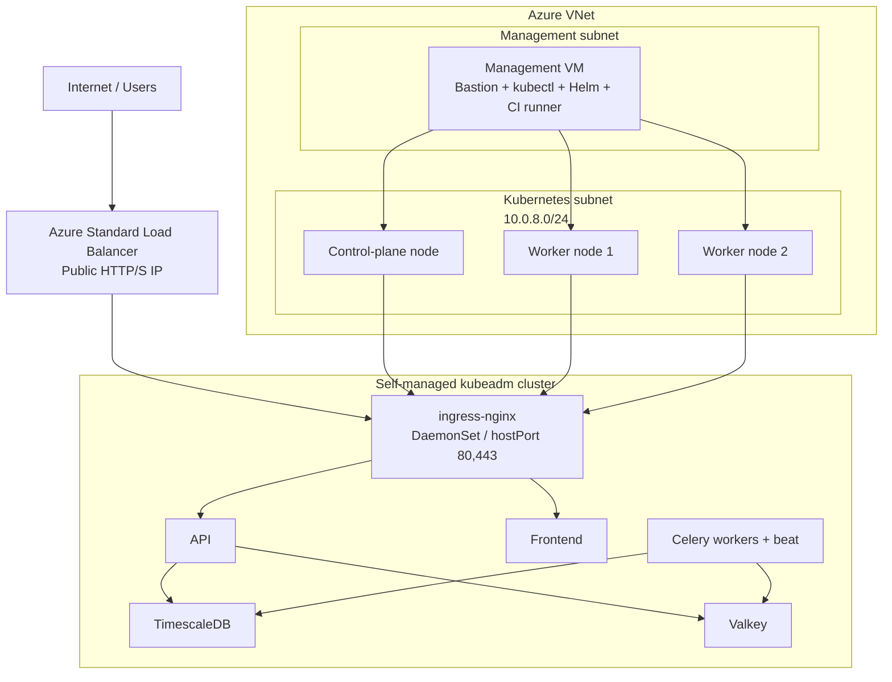
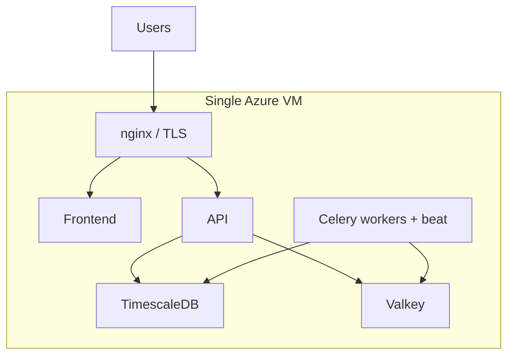

# OctoWatch Deployment Options

OctoWatch supports multiple deployment shapes, but the recommended production
path is now **self-managed Kubernetes on Azure VMs**.

The primary flow is:

**Terraform provisions Azure VMs → kubeadm creates the cluster → Helm deploys OctoWatch**

---

## Recommended Primary Deployment: Self-Managed Kubernetes

This is the default recommendation for production environments.

### Why this is the recommended path

- Predictable Azure costs
- Full control over cluster bootstrap, networking, storage, and upgrades
- No AKS abstraction layer between operators and Kubernetes
- Clean admin model through the dedicated management VM
- Reuses the existing Helm chart and GitHub Actions deployment workflow

### What Terraform provisions

- 1 management VM in `10.0.10.0/28`
- 3 Kubernetes nodes in `10.0.8.0/24` (1 control plane + 2 workers)
- Azure Standard Load Balancer for HTTP/S ingress
- Bootstrap storage for kubeconfig / join handoff and etcd backups

### What the management VM does

- Bastion / SSH jump host
- `kubectl` and Helm admin entry point
- Self-hosted CI runner
- etcd backup host

### Best fit

- Primary production deployments
- Teams comfortable operating Linux VMs and Kubernetes directly
- Environments that want Helm-based releases without managed-cluster coupling

---

## Development / Small Deployment: Single VM + Docker Compose

Docker Compose remains the fastest path for local development, demos, and small
single-tenant installations.

### Best fit

- Local development
- Evaluation environments
- Small production installs where a single host is acceptable

### Trade-offs

- Lowest operational overhead
- Lowest cost
- No infrastructure HA
- VM maintenance and application downtime are coupled

---

## Legacy (Deprecated): AKS

AKS is now a **legacy deployment path**.

- The migration rationale is documented in
  [`ADR-002`](./adr/ADR-002-aks-to-self-managed-k8s.md).
- Legacy AKS Terraform remains in [`terraform/aks.tf`](../terraform/aks.tf).
- Those resources are gated behind `var.enable_aks` and are **not** the
  recommended default for new deployments.

### When AKS still matters

- Existing environments that have not yet migrated
- Temporary compatibility work while old clusters are retired

### Operator guidance

Prefer planning migration to the self-managed kubeadm cluster rather than
expanding AKS usage.

---

## Legacy (Deprecated): Azure Container Apps

Azure Container Apps is no longer an active deployment recommendation for
OctoWatch.

- The old ACA migration runbook is retained only as an archived reference.
- New Azure deployments should use either:
  - **self-managed Kubernetes** for production, or
  - **Docker Compose** for development / small installs.

---

## Comparison Matrix

| Dimension | Self-managed Kubernetes | Docker Compose (single VM) | AKS | Azure Container Apps |
|-----------|-------------------------|----------------------------|-----|----------------------|
| Status | **Recommended** | Supported | Legacy / deprecated | Legacy / deprecated |
| Primary use | Production | Dev / small | Existing legacy installs | Archived reference only |
| Control over cluster config | Full | N/A | Partial | Low |
| Azure service cost | Moderate / predictable | Lowest | Higher | Variable |
| Kubernetes abstraction | None | N/A | AKS-managed | ACA-managed |
| Admin entry point | Management VM | SSH to VM | AKS control plane + kubectl | Azure control plane |
| Deployment method | Terraform + kubeadm + Helm | Terraform + Docker Compose | Terraform + Helm | Archived |

---

## Migration Guidance

### From AKS to self-managed Kubernetes

1. Provision the new kubeadm cluster with Terraform.
2. SSH to the management VM and verify all three nodes are `Ready`.
3. Create or sync required Kubernetes secrets.
4. Restore data with `pg_dump` / `pg_restore`.
5. Deploy the Helm chart to the new cluster.
6. Validate `/health` and `/ready`.
7. Cut DNS to the new Azure Load Balancer IP.

### From single VM to self-managed Kubernetes

1. Keep the VM deployment serving traffic.
2. Build the new cluster in parallel.
3. Restore the database into the Kubernetes deployment.
4. Deploy OctoWatch with Helm.
5. Validate end-to-end traffic.
6. Cut DNS and retire the old VM application tier.

---

## Recommendation Summary

- **Production on Azure**: use the self-managed kubeadm cluster.
- **Development / demos / smallest installs**: use Docker Compose.
- **Existing AKS environments**: treat as legacy and plan migration.
- **ACA**: treat as deprecated / archived.

---

## Related Documentation

- [`docs/deployment-guide.md`](./deployment-guide.md)
- [`docs/architecture.md`](./architecture.md)
- [`docs/runbooks/backup-restore.md`](./runbooks/backup-restore.md)
- [`terraform/README.md`](../terraform/README.md)
- [`docs/adr/ADR-002-aks-to-self-managed-k8s.md`](./adr/ADR-002-aks-to-self-managed-k8s.md)
