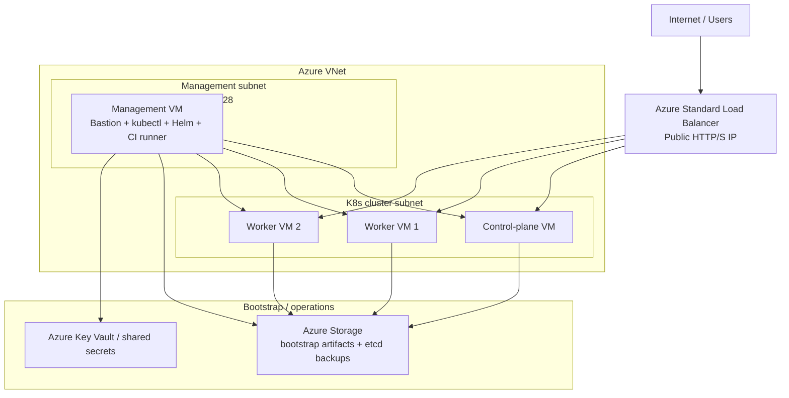

# OctoWatch — Terraform for Self-Managed Kubernetes on Azure

This Terraform configuration now documents the **primary** OctoWatch Azure
infrastructure: a self-managed kubeadm Kubernetes cluster on Azure VMs.

The main infrastructure definition is [`k8s-cluster.tf`](./k8s-cluster.tf).
Legacy AKS resources remain in [`aks.tf`](./aks.tf) behind `var.enable_aks` and
should be treated as compatibility-only.

---

## Architecture Overview



### What gets provisioned

- **Management VM** in `10.0.10.0/28`
  - public IP
  - SSH bastion / jump host
  - `kubectl` / Helm admin host
  - self-hosted GitHub Actions runner target
  - etcd backup host
- **3 Kubernetes nodes** in `10.0.8.0/24`
  - 1 control-plane VM
  - 2 worker VMs
  - no public IPs
- **Azure Standard Load Balancer**
  - public HTTP/S ingress only
  - cluster outbound SNAT for the private nodes
- **Azure Storage containers**
  - bootstrap artifact handoff
  - etcd backups

---

## Primary Files

| File | Purpose |
|------|---------|
| `k8s-cluster.tf` | Self-managed kubeadm cluster, management VM, LB, storage |
| `templates/cloud-init-k8s.yaml.tpl` | Control-plane / worker bootstrap |
| `templates/cloud-init-mgmt.yaml.tpl` | Management VM bootstrap |
| `outputs.tf` | Management VM, LB, and legacy output values |
| `aks.tf` | Legacy AKS resources gated by `enable_aks` |

---

## Prerequisites

### Tools

| Tool | Minimum Version |
|------|-----------------|
| Terraform | 1.7+ |
| Azure CLI | 2.55+ |
| SSH client | Any recent OpenSSH |

### Azure permissions

The principal running `terraform apply` should have:

- **Contributor** on the target resource group or subscription
- **User Access Administrator** where RBAC assignments are created

### SSH key

Generate a key pair for the management VM and cluster node access:

```bash
ssh-keygen -t ed25519 -C "octowatch-k8s" -f ~/.ssh/octowatch_k8s
```

---

## Deployment Steps

### 1. Create `terraform.tfvars`

At minimum, set values for:

- `environment`
- `location`
- `ssh_public_key`
- `ghcr_username`
- `ghcr_token`
- `ghcr_owner`
- any application secrets or naming inputs required by the stack

### 2. Initialize Terraform

```bash
terraform init
```

### 3. Plan

```bash
terraform plan -var-file=terraform.tfvars
```

### 4. Apply

```bash
terraform apply -var-file=terraform.tfvars
```

---

## What the bootstrap config does

### Management VM bootstrap

The management VM bootstrap installs and configures:

- Azure CLI
- `kubectl`
- Helm
- kubeconfig retrieval from Azure Storage
- `ghcr-pull-secret` creation in the `octowatch` namespace
- `cert-manager`
- `ingress-nginx`
- default storage class setup
- daily etcd backup cron

### Cluster node bootstrap

The cluster node bootstrap:

- installs `kubeadm`, `kubelet`, and `kubectl`
- initializes the control plane
- joins worker nodes
- configures pod networking
- mounts the data disk for persistent workload storage

---

## First-Day Operations

### Connect to the management VM

```bash
terraform output -raw k8s_mgmt_ssh_command
```

Example:

```bash
ssh octowatch@<management-public-ip>
```

### Verify the cluster

Run on the management VM:

```bash
kubectl get nodes -o wide
kubectl get pods -A
kubectl get storageclass
```

### Get the public ingress IP

```bash
terraform output -raw k8s_lb_public_ip
```

---

## Deploying OctoWatch after Terraform

Terraform provisions the infrastructure; the application itself is deployed with
Helm from the management VM.

```bash
cd /path/to/octowatch
helm dependency build ./helm
helm upgrade --install octowatch ./helm   -f helm/values.yaml   -f helm/values-selfmanaged.yaml   --namespace octowatch   --create-namespace   --wait --timeout 10m
```

---

## Important Outputs

| Output | Description |
|--------|-------------|
| `k8s_mgmt_public_ip` | Public IP of the management VM |
| `k8s_mgmt_ssh_command` | Ready-to-use SSH command |
| `k8s_lb_public_ip` | Public IP of the cluster load balancer |
| `k8s_node_private_ips` | Private IPs of the 3 cluster nodes |
| `k8s_ssh_jump_example` | Example SSH jump command through the management VM |

---

## Legacy AKS Resources

`aks.tf` still exists, but it is **legacy**:

- gated behind `var.enable_aks`
- retained for older environments that still reference AKS
- not the recommended target for new OctoWatch deployments

For the migration rationale, see:

- [`docs/adr/ADR-002-aks-to-self-managed-k8s.md`](../docs/adr/ADR-002-aks-to-self-managed-k8s.md)

---

## Related Documentation

- [`../docs/deployment-guide.md`](../docs/deployment-guide.md)
- [`../docs/deployment-options.md`](../docs/deployment-options.md)
- [`../docs/runbooks/backup-restore.md`](../docs/runbooks/backup-restore.md)
