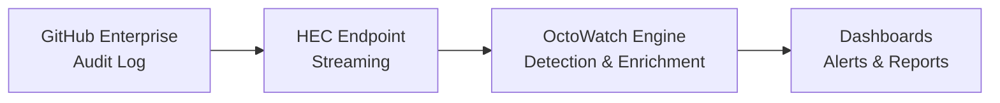

import { Card, CardGrid } from '@astrojs/starlight/components';

## Why OctoWatch?

OctoWatch transforms raw GitHub audit logs into actionable security intelligence. Monitor your entire GitHub Enterprise organization in real-time with automated threat detection, compliance reporting, and cross-organization visibility.

<CardGrid>
  <Card title="Real-Time Monitoring" icon="approve-check-circle">
    Ingest GitHub audit logs via HEC streaming and detect security events as they happen. No more waiting for quarterly audits.
  </Card>
  <Card title="Automated Detection" icon="warning">
    Built-in detection rules identify suspicious activity — from permission escalations to unusual access patterns — and alert your team instantly.
  </Card>
  <Card title="Compliance Reporting" icon="document">
    Generate SOC 2, HIPAA, and custom compliance reports on demand. Prove your security posture with auditable evidence.
  </Card>
  <Card title="Cross-Org Visibility" icon="open-book">
    Monitor multiple GitHub organizations from a single pane of glass. Correlate events across your entire enterprise footprint.
  </Card>
  <Card title="RBAC & Multi-Tenancy" icon="setting">
    Fine-grained role-based access control with organization-scoped permissions. Each team sees only what they need.
  </Card>
  <Card title="Self-Hosted & Secure" icon="rocket">
    Deploy on your own infrastructure via Helm on AKS or docker-compose. Your data never leaves your environment.
  </Card>
</CardGrid>

## How It Works

1. **Stream** — Configure GitHub Enterprise audit log streaming to OctoWatch's HEC endpoint
2. **Detect** — Detection rules analyze events in real-time for threats and anomalies  
3. **Alert** — Get notified of security events through your preferred channels
4. **Report** — Generate compliance reports and track your security posture over time
