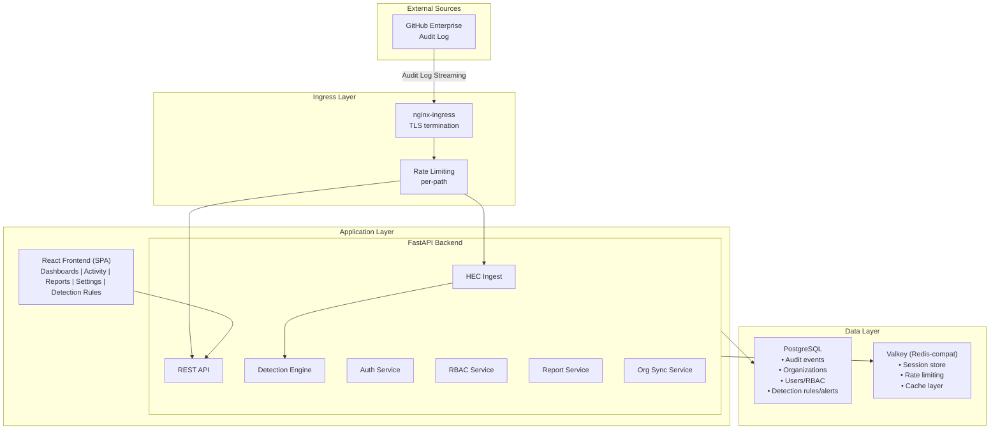
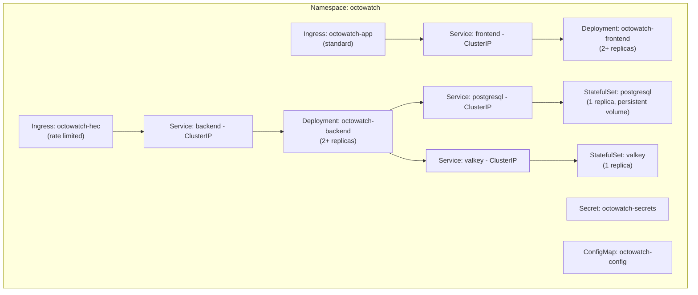

OctoWatch is a multi-tier application designed for reliability, scalability, and security. This page describes the system architecture, component interactions, and deployment topology.

## System Overview

## Component Details

### Ingress Layer

- **nginx-ingress**: TLS termination, routing, and path-based rate limiting
- Separate ingress resources with per-path rate limits:
  - `/services/collector` (HEC) — Higher rate limit for streaming
  - `/` (all other traffic) — Standard UI/API limits

### Backend (FastAPI)

The Python backend handles all business logic:

| Service | Responsibility |
|---------|---------------|
| **HEC Ingest** | Receives and parses Splunk HEC formatted events |
| **REST API** | Serves the frontend (queries, reports, settings) |
| **Detection Engine** | Evaluates rules against incoming events |
| **Auth Service** | GitHub OAuth, JWT token management |
| **RBAC Service** | Permission enforcement per request |
| **Report Service** | Compliance report generation |
| **Org Sync** | GitHub organization metadata synchronization |

### Frontend (React)

Single-page application providing:
- Real-time activity dashboards
- Event search and filtering
- Compliance report builder
- Detection rule management
- System administration UI

### Data Layer

- **PostgreSQL**: Primary data store for all persistent data
- **Valkey**: Session management, caching, and rate limit counters

## Deployment Topology (Kubernetes)

## Data Flow

### Audit Log Ingestion

1. GitHub streams audit events to the HEC endpoint
2. nginx-ingress rate-limits and forwards to backend
3. Backend validates the HEC token
4. Events are parsed and normalized
5. Detection engine evaluates all active rules
6. Events are persisted to PostgreSQL
7. Any triggered alerts are created and notifications sent

### User Request

1. User authenticates via GitHub OAuth
2. JWT token stored in HTTP-only cookie
3. Frontend makes API requests with cookie
4. Backend validates JWT and checks RBAC permissions
5. Query executed against PostgreSQL
6. Results returned (cached in Valkey where appropriate)

## Security Considerations

- All external traffic is TLS-encrypted
- HEC endpoint requires authentication token
- User sessions use HTTP-only, secure cookies
- RBAC enforced on every API request
- Rate limiting prevents abuse
- No data leaves the deployment environment
