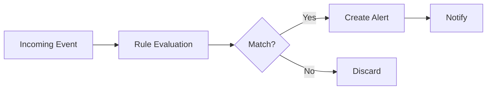

OctoWatch's detection engine evaluates incoming audit events against configurable rules. When a rule matches, an alert is created and notifications are sent.

## How Detection Works



Rules are evaluated in real-time as events are ingested. Each rule defines:

- **Conditions**: What event patterns to match
- **Severity**: How critical the detection is
- **Actions**: What to do when triggered (alert, notify, etc.)

## Built-in Rules

OctoWatch ships with detection rules for common security scenarios:

### Permission & Access

| Rule | Severity | Description |
|------|----------|-------------|
| `permission_escalation` | High | User granted owner/admin role in an organization |
| `repo_visibility_change` | High | Repository changed from private to public |
| `branch_protection_removed` | High | Branch protection rules disabled |
| `deploy_key_added` | Medium | New deploy key added to a repository |
| `collaborator_added_external` | Medium | Outside collaborator added to a repo |

### Authentication & Identity

| Rule | Severity | Description |
|------|----------|-------------|
| `2fa_disabled` | Critical | Two-factor authentication disabled by a user |
| `sso_bypass` | High | Access via non-SSO authentication when SSO is required |
| `pat_created_admin_scope` | Medium | Personal access token created with admin scopes |
| `oauth_app_authorized` | Low | New OAuth application authorized |

### Data & Secrets

| Rule | Severity | Description |
|------|----------|-------------|
| `secret_scanning_alert` | High | Secret detected in a repository |
| `repo_forked_external` | Medium | Repository forked to outside the organization |
| `repo_downloaded_archive` | Low | Repository archive downloaded |

### Administrative

| Rule | Severity | Description |
|------|----------|-------------|
| `audit_log_export` | Medium | Audit log exported by a user |
| `ip_allow_list_modified` | High | Organization IP allow list changed |
| `saml_config_changed` | Critical | SAML SSO configuration modified |
| `webhook_created` | Low | New webhook created on org or repo |

## Custom Rules

### Creating a Rule

Navigate to **Detection** → **Rules** → **New Rule**, or use the API:

```json
{
  "name": "custom_repo_deletion",
  "description": "Alert when any repository is deleted",
  "enabled": true,
  "severity": "high",
  "conditions": {
    "action": "repo.destroy",
    "actor_role": {"not": "owner"}
  },
  "organizations": ["my-org"],
  "notifications": {
    "channels": ["slack", "email"]
  }
}
```

### Condition Syntax

Conditions support:

| Operator | Example | Description |
|----------|---------|-------------|
| Exact match | `"action": "repo.destroy"` | Field equals value |
| Pattern | `"action": "repo.*"` | Glob pattern matching |
| Not | `"actor": {"not": "bot-user"}` | Negation |
| In | `"action": {"in": ["repo.destroy", "repo.archive"]}` | One of many values |
| Regex | `"actor": {"regex": "^bot-.*"}` | Regular expression |

### Rule Testing

Test a rule against historical events before enabling:

1. Create the rule with `"enabled": false`
2. Click **"Test Rule"** in the UI
3. Review matches from the last 7 days
4. Enable when satisfied with accuracy

## Alert Management

### Alert States

| State | Meaning |
|-------|---------|
| **New** | Alert created, not yet reviewed |
| **Acknowledged** | Team is aware, investigating |
| **Resolved** | Issue addressed, alert closed |
| **False Positive** | Not a real threat, dismissed |

### Alert Enrichment

Alerts include contextual information:

- Actor details (username, role, 2FA status)
- Affected resource (repo, team, org)
- Timeline of related events (±1 hour)
- Risk score based on actor behavior history
